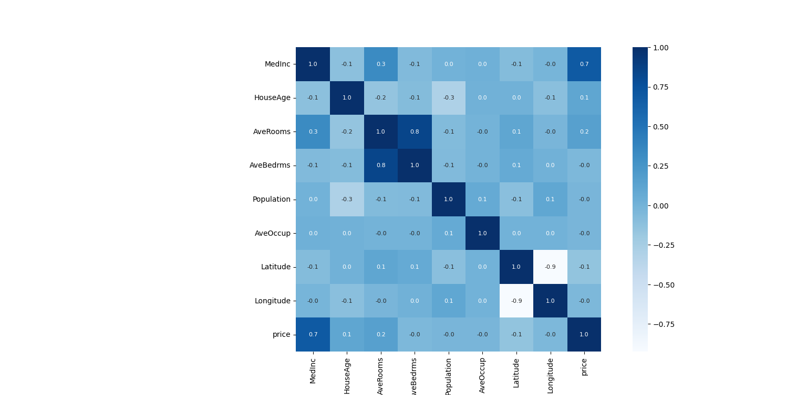
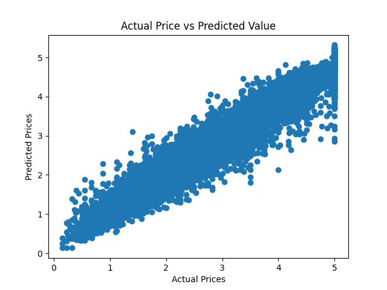

# 🏡 California Housing Price Prediction

This project predicts California housing prices using the **XGBoost Regressor**.  
The dataset is imported directly from `scikit-learn` using `fetch_california_housing`.

---

## 📌 Features
- Loads and explores the California housing dataset
- Performs **data analysis** and visualizations (correlation heatmap, scatter plots)
- Splits data into **training** and **test** sets
- Trains an **XGBoost Regressor model**
- Evaluates the model using:
  - R² Score
  - Mean Absolute Error (MAE)
- Visualizes **Actual vs Predicted Prices**

---

## ⚙️ Installation

Clone the repository:

```bash
git clone https://github.com/momin-kiani/house-price-prediction.git
cd house-price-prediction

## 📊 Example Outputs

### Correlation Heatmap


### Actual vs Predicted Prices (Training Data)


---

## 📈 Model Performance

### Training Data
- **R² Score:** 0.9436  
- **Mean Absolute Error:** 0.1934  

### Test Data
- **R² Score:** 0.8338  
- **Mean Absolute Error:** 0.3109  
